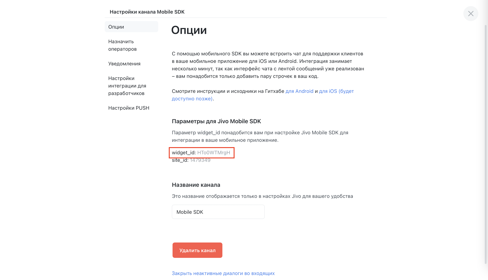
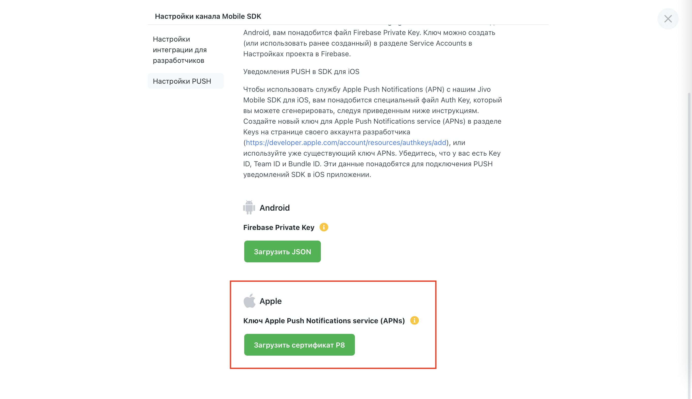

# Jivo Mobile SDK for iOS


1. [Введение](#intro)
2. [Настройка канала в Jivo](#channel)
3. [Подготовка мобильного проекта](#prepare)
4. [Установка Jivo Mobile SDK](#install)
5. [Принцип использования Jivo Mobile SDK](#usage)
6. [Детальное Jivo Mobile SDK API](#api)


# <a name="intro">Введение</a>

**Jivo Mobile SDK** – это фреймворк для интеграции бизнес-чата **Jivo** в ваше приложение. Для взаимодействия с SDK доступно несколько вариантов API:

- Swift / Objective-C
- React Native


Текущая конфигурация:

- Есть локализация на языки: русский, английский, испанский, португальский, турецкий
- Нет поддержки Bitcode


# <a name="channel">Настройка канала в Jivo</a>

> Для работы **Jivo Mobile SDK** вам потребуется канал типа `"Мобильное SDK"`.
> Его создание доступно только в [корпоративной версии **Jivo**](https://www.jivo.ru/pricing/).

1. В личном кабинете **Jivo** перейдите на экран `"Управление" -> "Каналы связи"` и создайте там новый канал `"Мобильное SDK"`.


2. Перейдите в настройки созданного канала, раздел `"Опции"`, и найдите в пункте `"Параметры для Jivo Mobile SDK"` значение `widget_id`. Это значение будет использоваться при работе с **Jivo Mobile SDK** везде, где потребуется указать `channelID`.

> Поля `widget_id` в настройках канала `"Мобильное SDK"`
> и `channelID` в **Jivo Mobile SDK API** – это одно и то же.





# <a name="prepare">Подготовка мобильного проекта</a>

Для полноценной работы **Jivo Mobile SDK** предстоит выполнить несколько приготовлений.

### Разрешения приложения 

**Jivo Mobile SDK** использует камеру устройства. Также ему необходим доступ к фотогалерее. Для получения необходимых разрешений добавьте соответствующие ключи в файл `Info.plist` вашего проекта:

- `NSCameraUsageDescription`

    Ключ и описание для ключа, нужны для доступа к камере устройства

- `NSPhotoLibraryUsageDescription`

    Ключ и описание для ключа, нужны для доступа к фотогалерее устройства

### Настройка PUSH-уведомлений

> PUSH-уведомления работают <u>только в production окружении</u>, иными словами, протестировать их работу возможно только при распространении через AdHoc, TestFlight или App Store.

> PUSH-уведомления отправляются только тогда, когда соединение между **Jivo Mobile SDK** и нашим сервером закрыто. Соединение разрывается, когда закрывается окно чата. После этого мы начинаем отправлять PUSH-уведомления. Таким образом, вы можете настроить отображение уведомлений от **Jivo** внутри вашего приложения для состояния foreground.


##### Signing & Capabilities

В настройках проекта во вкладке `Signing & Capabilities` добавьте пункт (capability) `Push Notifications`, если он у вас ещё не добавлен.


##### Переводы в Localizable.strings

Наши PUSH-уведомления используют локализацию на стороне клиента (подробнее в разделе ["Localize Your Alert Messages" от Apple](https://developer.apple.com/documentation/usernotifications/setting_up_a_remote_notification_server/generating_a_remote_notification), для чего в качестве заголовка и сообщения указаны ключи локализации, поэтому вам нужно добавить в файлы локализации `Localizable.strings` вашего проекта строки для следующих ключей:

- `"JV_MESSAGE_TITLE"`

    Ключ заголовка PUSHа

- `"JV_MESSAGE"`

    Ключ сообщения PUSHа


Помимо ключей, в теле PUSH-уведомления мы передаём ещё и аргументы, которые вы также можете использовать при локализации текста: 

- первый аргумент содержит имя собеседника, кто отправил сообщение
- второй аргумент содержит текст сообщения


Вот пример того, как может выглядеть локализация текста PUSH-уведомления в файле локализации `*.strings` для русского языка: 

```
"JV_MESSAGE_TITLE" = "Поддержка"; 
"JV_MESSAGE" = "%1$@: %2$@";
```


##### APNs Key

Добавьте ключ для Apple Push Notifications service (APNs) в разделе `Keys` на странице своего аккаунта в [developer.apple.com](developer.apple.com) (или используйте уже существующий ключ APNs),
сохраните его – сервис предложит вам загрузить ключ в виде файла с расширением `p8`.

> Создав ключ для APNs, сохраните его в надёжном месте.
> Созданный ключ APNs возможно скачать <u>только один раз</u>!


Добавьте ключ APNs в виде файла с расширением `p8` к вашему каналу` "Мобильное SDK"`. Для этого перейдите в `"Управление" -> "Каналы связи" -> "Мобильное SDK" (кнопка "Настроить") -> "Настройки PUSH" -> "Загрузить сертификат P8"`.



Также помимо самого ключа APNs, вам нужно будет указать:

- `key_id`

    Идентификатор этого ключа

- `team_id`

    Team ID вашей учётной записи в Apple Developer Program

- `bundle_id`

    Bundle ID вашего приложения


# <a name="install">Установка Jivo Mobile SDK</a>

### Требования

Для установки **Jivo Mobile SDK** в свой проект Xcode вам потребуется: 
- Xcode 13.0 или новее
- CocoaPods 1.10.0 или новее
- Установить `Deployment Target` в проекте на версию iOS 11.0 или более новую

### Шаги установки
1. Укажите в начале `Podfile` своего проекта следующие источники: 
```ruby
source 'https://github.com/CocoaPods/Specs.git' 
source 'https://github.com/JivoChat/JMSpecsRepo.git'
```

2. Добавьте `JivoSDK` как зависимость в вашем `Podfile`:
```ruby
use_frameworks!

target :YourTargetName do
  pod 'JivoSDK' #, '~> 2.1'
end
```

> При подключении SDK таким способом, в случае выполнении команды `pod update` будет устанавливаться самая свежая версия SDK из доступных. Если же по каким-либо причинам вам нужно сохранить совместимость SDK и вашего текущего кода как можно дольше, можете убрать знак решётки перед указанием версии: тогда переход на другую major версию учитываться не будет.

3. Добавьте `post_install` блок, обычно его ставят в конце `Podfile`:

```ruby
post_install do |installer| 
  installer.pods_project.targets.each do |target| 
    target.build_configurations.each do |config| 
      config.build_settings['BUILD_LIBRARY_FOR_DISTRIBUTION'] = 'YES' 
    end 
  end 
end
```

> Этот блок `post_install` добавляет поддержку [Module Stability](https://www.swift.org/blog/library-evolution/) для всех pods в вашем проекте. Это необходимо для того, чтобы один и тот же пакет `JivoSDK.xcframework` можно было использовать, не пересобирая на всех версиях Xcode выше 13.0 (версия, на которой `JivoSDK.xcframework` был собран). Корректная работа **Jivo SDK** возможна только в том случае, если все его зависимости также будут поддерживать Module Stability.

4. Выполните в терминале команду: 
```bash
pod install
```


### Для React Native

Для установки **Jivo Mobile SDK** в проект на React Native понадобится выполнить как все инструкции из текущего раздела, так и дополнительные инструкции [отсюда](README/react_setup.md##cocoapods).


# <a name="usage">Принцип использования Jivo Mobile SDK</a>

Для нативных проектов **Jivo Mobile SDK API** поделено на несколько пространств имён:
- `session`

    Отвечает за всё, что связано с сеансом коммуникации, например, подключение и данные клиента
- `chattingUI`

    Отвечает за всё, что связано с визуальным представлением чата на экране
- `notifications`

    Содержит в себе методы, отвечающие за настройку и обработку PUSH-уведомлений
- `debugging`

    Помогает с отладкой SDK

Каждое из этих пространств содержит методы и свойства, объединённые общей областью ответственности, и каждому из них соответствует статический объект, доступ к которому можно получить из **Jivo SDK Mobile API**, например:

```
JivoSDK.[пространство_имён].[метод_или_свойство]
```


### Пример кода для отображения UI чата SDK на экране:

```swift
final class AppDelegate: UIResponder, UIApplicationDelegate {
    func application(_ application: UIApplication, didRegisterForRemoteNotificationsWithDeviceToken deviceToken: Data) {
        JivoSDK.notifications.setPushToken(data: deviceToken)
    }
}

final class ProfileViewController {
    // ...

    private func pushSupportScreen() {
        guard let container = self.navigationController else { return }
        JivoSDK.session.startUp(channelID: "abcdef", userToken: "user@example.com")
        JivoSDK.chattingUI.push(into: container)
    }

    private func presentSupportScreen() {
        JivoSDK.session.startUp(channelID: "abcdef", userToken: "user@example.com")
        JivoSDK.chattingUI.present(over: self)
    }
}
```


### Для React Native

Вариант использования **Jivo Mobile SDK** в проекте на React Native несколько отличается от нативного, предлагаем вам ознакомиться с ним отдельно – [здесь](./README/react_setup.md#usage).


# <a name="api">Детальное Jivo Mobile SDK API</a>

### Для нативного проекта

**Jivo Mobile SDK API: Native** – в [этом документе](README/native_api.md).

### Для React Native

**Jivo Mobile SDK API: React** – [в этом документе](README/react_api.md).

