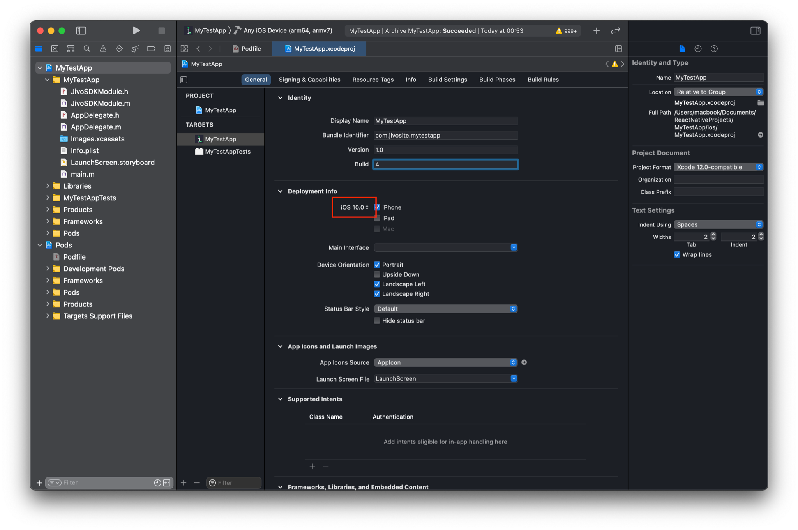
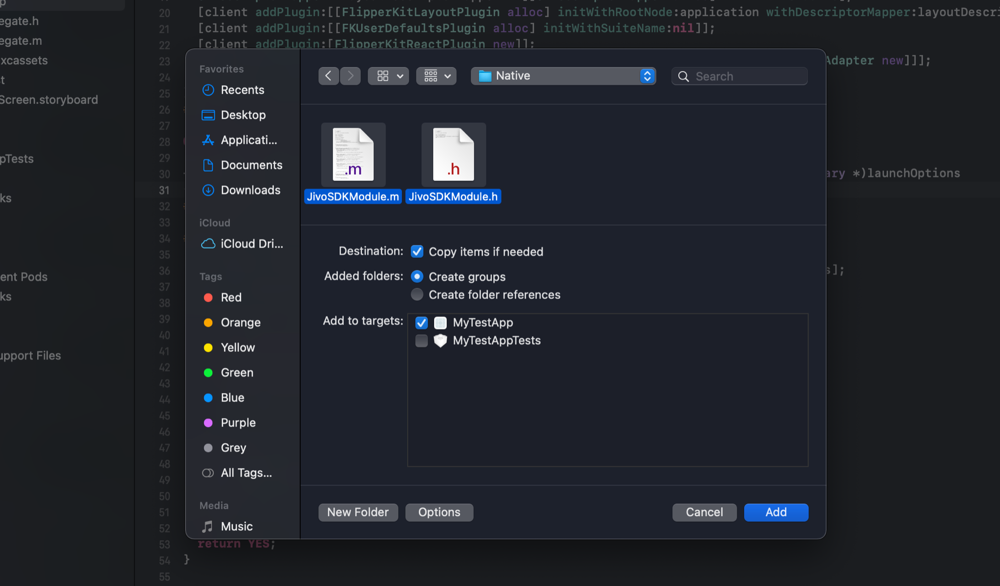

# Jivo Mobile SDK for iOS: additional setup for React Native project
This manual is in addition to the [main instruction](../README_en.md).
In other words, you must first follow the steps of the main manual, and then additionally follow the steps described below.

- [CocoaPods configuration](#cocoapods)
- [Usage](#usage)


## <a name="cocoapods">CocoaPods configuration</a>

1. Install plugin [`cocoapods-user-defined-build-types`](https://github.com/joncardasis/cocoapods-user-defined-build-types).
   For this:

     - Run the following command in the terminal:

   ```bash
   gem install cocoapods-user-defined-build-types
   ```

     - Specify plugin in `Gemfile`:

       ```ruby
       gem 'cocoapods-user-defined-build-types'
       ```
     - Specify and activate the plugin in the `Podfile` of your Xcode project, which is usually located in the `ios` folder:

       ```ruby
       plugin 'cocoapods-user-defined-build-types' # specify the plugin
       enable_user_defined_build_types! # activate it
       
       target 'YourAwesomeApp' do  
         ...
       end
       ```

   > The `cocoapods-user-defined-build-types` plugin is required for the following reason. CocoaPods out of the box does not allow you to configure the build type (static or dynamic library / framework) separately for each dependency specified in the `Podfile`. Instead, you can only specify the build type for all dependencies at once using the `use_frameworks!` directive.
   >
   > In our case, `Podfile` must necessarily list React Native dependencies (for example, `React`), some of which are static frameworks. We also need to specify the `JivoSDK` dependency, which is a dynamic framework.
   >
   > Since our Podfile must have both static and dynamic dependencies at the same time, we can't use the `use_frameworks!` directive, and we need a way to set the build type on a per-dependency basis. This method is provided by the `cocoapods-user-defined-build-types` plugin.

2. Specify the `dynamic_framework` build type in the Podfile for the **JivoSDK** dependency:
    ```ruby
    target 'YourAwesomeApp' do
      pod 'JivoSDK', ‘~> 3.0’, :build_type => :dynamic_framework
      ...
    end
    ```

4. Dynamic linking can lead to linking problems if the main project or its dependencies have different `Deployment Target` settings; so you need to add another `IPHONEOS_DEPLOYMENT_TARGET` to the `post_install` block in the Podfile to make it look something like this:
    ```ruby
    post_install do |installer|
      JivoPatcher.new(installer).patch()
    end
    
    class JivoPatcher
      def initialize(installer)
        @sdkname = "JivoSDK"
        @installer = installer
      end
      
      def patch()
        libnames = collectLibNames()
        
        @installer.pods_project.targets.each do |target|
          target.build_configurations.each do |config|
            if libnames.include? target.to_s
              config.build_settings['BUILD_LIBRARY_FOR_DISTRIBUTION'] = 'YES'
              config.build_settings['GENERATE_INFOPLIST_FILE'] = 'YES'
              # config.build_settings['IPHONEOS_DEPLOYMENT_TARGET'] = '13.0'
            end
          end
        end
      end
      
      private def collectLibNames()
        depnames = Array.new
        
        @installer.pod_targets.each do |target|
          next if target.to_s != @sdkname
          depnames = collectTargetLibNames(target)
        end
        
        return depnames.uniq()
      end
    
      private def collectTargetLibNames(target)
        depnames = [target.to_s]
        
        target.dependent_targets.each do |subtarget|
          depnames += [subtarget.to_s] + collectTargetLibNames(subtarget)
        end
        
        return depnames
      end
    end
    ```
    
    You can see which version of iOS is specified as the main `Deployment Target` in the settings of the main target:



5. While in the directory where `Podfile` is located, run the command in the terminal:
    ```bash
    pod install
    ```

6. Add the `JivoSDKModule.h` and `JivoSDKModule.m` files from the [Jivo Mobile SDK repository](https://github.com/JivoChat/JivoSDK-iOS) under the path `React Native Module/Native` to your Xcode project:

    

    

    > <u>Don't forget to check the checkbox</u> `“Copy items if needed”`

7. Add the `JivoSDKModule.js` file to the React Native project, located in the [Jivo Mobile SDK repository](https://github.com/JivoChat/JivoSDK-iOS) under the path `ReactNativeModule/JivoSDKModule.js`.


## <a name="usage">Usage</a>

[**Jivo Mobile SDK API: React**](react_api_en.md) contains a set of methods similar in functionality to the set of methods and properties presented in [**Jivo Mobile SDK API: Native**](native_api_en.md). The only difference is in their names and how they are accessed:

```
JivoSDK.[called_method];
```

All operations within the called methods are performed asynchronously. For methods that expect to return a result of execution, passing a callback function as a parameter is used.

Methods take parameters of a strictly defined type. If the type of the data passed to the method does not match the expected one, a corresponding warning will appear in the debug console of the React Native application.

In order to access the **JivoSDK** module in JavaScript, you need to import this module:

```js
import JivoSDK from '[path to the directory where JivoSDKModule.js is located]/JivoSDKModule';
```

Sample code for displaying the SDK chat UI on the screen:

```javascript
import JivoSDK from './JivoSDKModule';

const JivoSDKButton = () => {
  const myImage = require('./someImage.png');
  const resolveAssetSource = require('react-native/Libraries/Image/resolveAssetSource');
  const resolvedImage = resolveAssetSource(myImage);

  const onPress = () => {
    JivoSDK.startUpSession("ABCD12345", "some_token");
    JivoSDK.presentChattingUIWithConfig({
      "localeIdentifier": "ru_RU",
      "icon": resolvedImage,
      "titlePlaceholder": "Some title placeholder",
      "subtitleCaption": "Some subtitle caption",
      "inputPlaceholder": "Some input placeholder",
      "titleColor": "#AA33FF",
      "subtitleColor": "#CC2211",
    });
  };

  return (
    <Button
      title="Present Jivo SDK screen"
      color="#841584"
      onPress={onPress}
    />
  );
}

const App: () => Node = () => {
  const backgroundStyle = {
    backgroundColor: "#000000",
  };

  return (
    <SafeAreaView style={backgroundStyle}>
      <StatusBar barStyle='light-content' />
      <JivoSDKButton />
    </SafeAreaView>
  );
};
```

